# Solfolio
[Solfolio - Powered By Zerion API](https://solfolio.eferbarn.com/)
---

## 🧭 Solana Portfolio Tracker — Powered by Zerion API
Solfolio is a lightweight web app that gives you a clear and real-time overview of your Solana wallet.
It connects to the Zerion API, fetching accurate portfolio insights, token balances, and performance analytics; all in one minimal dashboard.

## 🚀 Core Features
* Portfolio Overview: Instantly view your wallet's total value and asset allocation.
* PnL Tracking: Track your Realized and Unrealized profit/loss with precision.
* Token Insights: Get up-to-date prices, holdings, and changes for all SPL tokens.
* Zerion-Powered Data: All analytics are powered by Zerion's institutional-grade API.
* Fast & Privacy-Friendly: No backend, no data collection; just your wallet, your stats.

## 💡 Why Zerion API?
Zerion offers one of the most reliable multi-chain APIs, providing deep coverage for Solana, which enables precise portfolio and transaction analytics without compromising user data or speed.

```mermaid
graph LR
    A[💙 Connecting to the Zerion API] --> B[🎯 Fetching insights]
    B --> C[📊 Showing on a minimalistic UI]
```

---

Hope you enjoy it!
Made with ❤️

---
